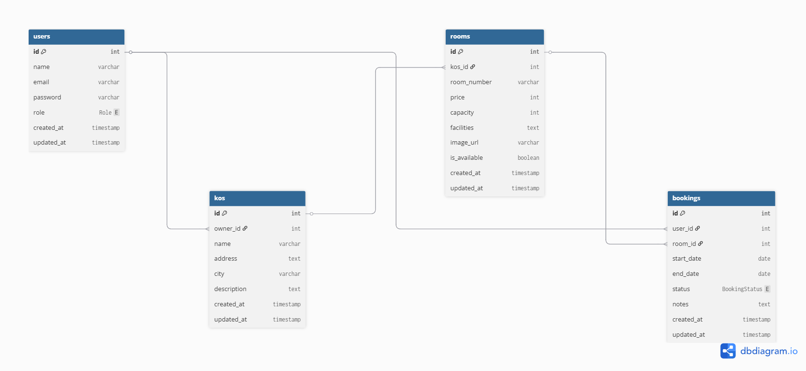

# Booking Kost Management System Backend API

A RESTful backend API for a boarding house (kost) booking and management platform built with NestJS, Prisma, PostgreSQL, and JWT authentication.

---

# Deployment Links

## Live Backend API

The backend API has been deployed using Railway.

Live API: https://your-railway-domain.up.railway.app

---

# Project Documentation

Documentation: Coming soon

---

# Frontend Deployment

Frontend URL: Coming soon

---

# Presentation

Presentation Slides: Coming soon

---

# Features

- JWT Authentication
- Role-Based Authorization
- Protected Routes
- Kos Management System
- Room Management System
- Booking Management System
- Booking Approval & Rejection
- Booking History Tracking
- Duplicate Booking Prevention
- DTO Validation
- Relational Database Management

---

# Tech Stack

- NestJS
- TypeScript
- Prisma ORM
- PostgreSQL / Neon
- JWT Authentication
- Railway Deployment
- class-validator

---

# Project Structure

```txt
src/
├── auth/
├── bookings/
├── kos/
├── rooms/
├── prisma/
└── common/
```

---

# ERD (Entity Relationship Diagram)



## Relationships

- One User can have many Kos
- One Kos can have many Rooms
- One User can have many Bookings
- One Room can have many Bookings

---

# Installation

## Install Dependencies

```bash
npm install
```

---

# Environment Variables

Create `.env` file:

```env
DATABASE_URL=
JWT_SECRET=
```

---

# Run Application

## Development

```bash
npm run start:dev
```

## Production

```bash
npm run build
npm run start:prod
```

---

# Prisma Commands

## Generate Prisma Client

```bash
npx prisma generate
```

## Run Migration

```bash
npx prisma migrate dev
```

## Open Prisma Studio

```bash
npx prisma studio
```

---

# Authentication

This API uses JWT authentication.

Example protected route header:

```txt
Authorization: Bearer <access_token>
```

---

# Main Modules

| Module   | Description                    |
| -------- | ------------------------------ |
| Auth     | Authentication & authorization |
| Kos      | Boarding house management      |
| Rooms    | Room management system         |
| Bookings | Booking & approval management  |
| Prisma   | Database connection management |

---

# Roles

## USER

- View available kos
- View rooms
- Create booking
- View booking history

## OWNER

- Create kos
- Update kos
- Delete kos
- Create room
- Update room
- Delete room
- View incoming bookings
- Approve or reject bookings

## ADMIN

- Access all data
- Access all bookings
- Manage all resources

---

# API Endpoints

## Authentication

### Register

```http
POST /auth/register
```

### Login

```http
POST /auth/login
```

### Profile

```http
GET /auth/profile
```

---

## Kos

### Get All Kos

```http
GET /kos
```

### Create Kos

```http
POST /kos
```

### Update Kos

```http
PATCH /kos/:id
```

### Delete Kos

```http
DELETE /kos/:id
```

---

## Rooms

### Get All Rooms

```http
GET /rooms
```

### Create Room

```http
POST /rooms
```

### Update Room

```http
PATCH /rooms/:id
```

### Delete Room

```http
DELETE /rooms/:id
```

---

## Bookings

### Create Booking

```http
POST /bookings
```

### Get All Bookings (OWNER / ADMIN)

```http
GET /bookings
```

### Get User Booking History

```http
GET /bookings/my-bookings
```

### Update Booking Status

```http
PATCH /bookings/:id/status
```

---

# Business Rules

- OWNER can only manage their own kos and rooms
- OWNER can only approve/reject bookings for their own kos
- USER can only view their own booking history
- Duplicate active bookings are prevented
- Booking status starts as `PENDING`

---

# Project Goal

This project demonstrates:

- RESTful API development
- Modular backend architecture
- JWT authentication
- Role-based authorization
- DTO validation
- Relational database management
- Production-oriented backend structure
- Booking approval workflow system

---

# Current Status

Backend core system completed.

Implemented:

- Authentication System
- Authorization System
- Kos CRUD
- Room CRUD
- Booking System
- Booking Approval Flow
- Booking History
- Railway Deployment
- Neon PostgreSQL Integration

---

# Author

Fakhridho Gunawan
